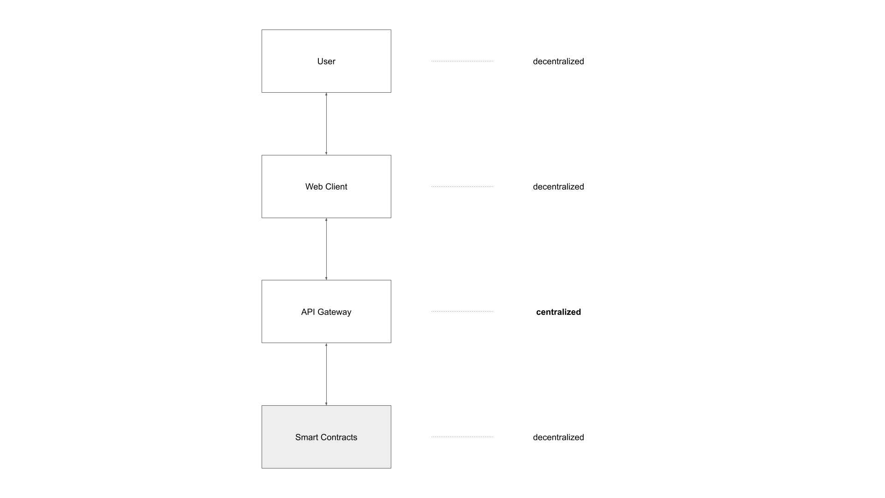

# Smart Contracts

<figure><figcaption></figcaption></figure>

The Smart Contracts of the Fortress protocol are fully decentralized, public and available for anyone. All code is available at [https://github.com/FortressFinance/fortress-contracts](https://github.com/FortressFinance/fortress-contracts). The Fortress Smart Contracts can always be accessed by anyone using the relevant blockchain explorers, e.g. Etherscan, Arbiscan etc. Topologically the Web Client and API Gateway work against the deployed Smart Contracts in order to service Fortress users.&#x20;
